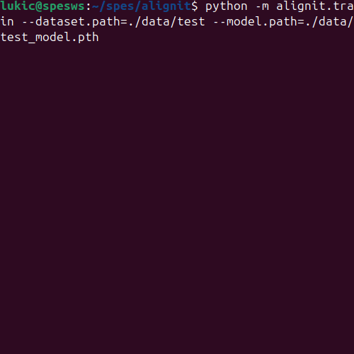

# AlignIt

Model-free real-time robot arm alignment using one or more RGB(D) cameras.

<div align="center">
  <a href="#">
    
  </a>
  <a href="#">
    
  </a>
  <a href="#">
    
  </a>
</div>

<div align="center">
Record → Train → Align
</div>

### Getting Started

```bash
# Record a dataset
python -m alignit.record --dataset.path=./data/test

# Use the dataset to train a model
python -m alignit.train --dataset.path=./data/test --model.path=./data/test_model.pth

# Visualize dataset
python -m alignit.visualize --dataset.path=./data/test

# Run inference
python -m alignit.infere --model.path=./data/test_model.pth
```

### Development

```bash
# Install the package in editable mode
git clone https://github.com/SpesRobotics/alignit.git
cd alignit
pip install -e .

# Run tests
python -m pytest
```
